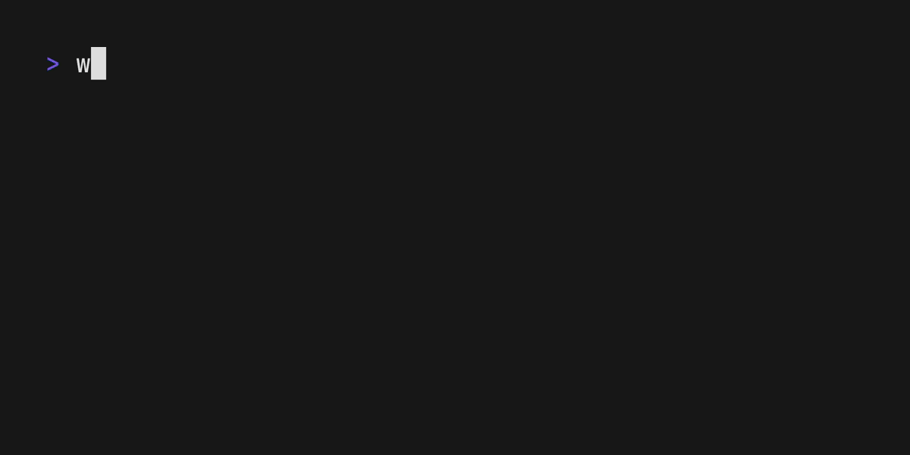
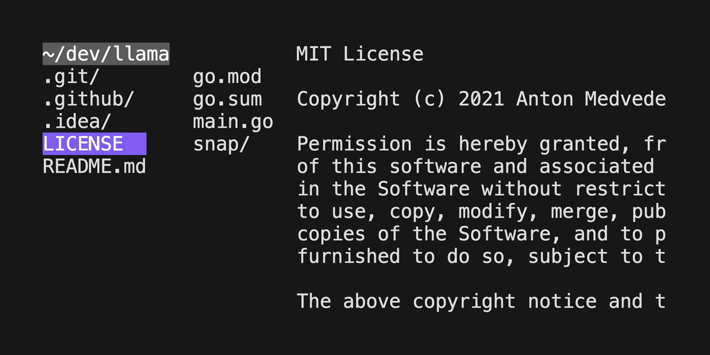
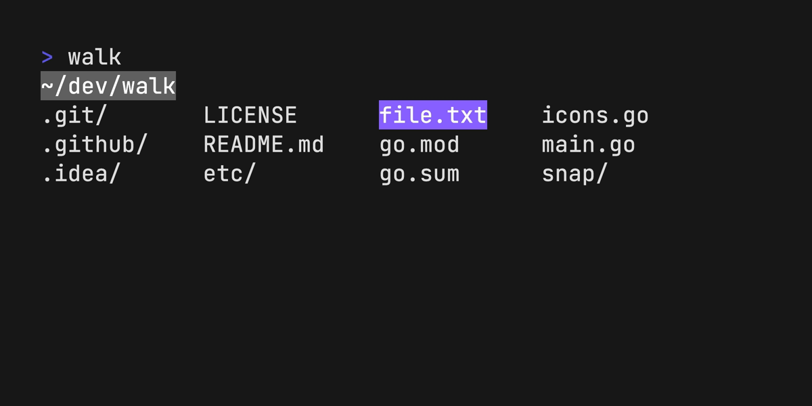

# 🥾 walk

<p align="center">
  <br>
  
  <br>
</p>

Walk — a terminal navigator.

Why another terminal navigator? I wanted something simple and minimalistic.
Something to help me with faster navigation in the filesystem; a `cd` and `ls`
replacement. So I build "walk". It allows for quick navigation with fuzzy
searching. `cd` integration is quite simple. And you can open `vim` right from
the walk. That's it.

## Install

```
brew install walk
```

```
snap install walk
```

```
pkg_add walk
```

```
go install github.com/antonmedv/walk@latest
```

Or download [prebuild binaries](https://github.com/antonmedv/walk/releases).

Put the next function into the **.bashrc** or a similar config:

<table>
<tr>
  <th> Bash/Zsh </th>
  <th> Fish </th>
  <th> PowerShell </th>
</tr>
<tr>
<td>

```bash
function lk {
  cd "$(walk "$@")"
}
```

</td>
<td>

```fish
function lk
  set loc (walk $argv); and cd $loc;
end
```

</td>
<td>

```powershell
function lk() {
  cd $(walk $args)
}
```

</td>
</tr>
</table>


Now use `lk` command to start walking.

## Usage

| Key binding      | Description        |
|------------------|--------------------|
| `Arrows`, `hjkl` | Move cursor        |
| `Enter`          | Enter directory    |
| `Backspace`      | Exit directory     |
| `Space`          | Toggle preview     |
| `Esc`            | Exit with cd       |
| `Ctrl+C`         | Exit without cd    |
| `/`              | Fuzzy search       |
| `dd`             | Delete file or dir |

The `EDITOR` or `WALK_EDITOR` environment variable used for opening files from
the walk.

```bash
export EDITOR=vim
```

Preview mode:



Delete file or directory:




## Command-line options

##### `--icons` display icons

Install [Nerd Fonts](https://www.nerdfonts.com) to get the icons to render properly.


## License

[MIT](LICENSE)
