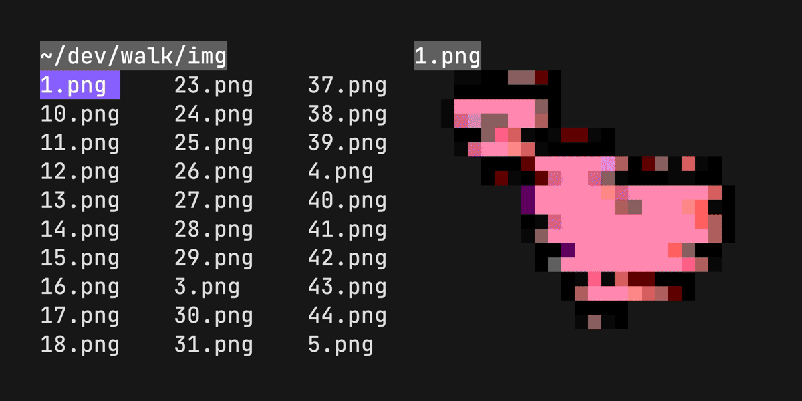

# 🥾 walk

<p align="center">
  <br>
  
  <br>
</p>

**Walk** — a terminal navigator; a `cd` and `ls` replacement.

Run `lk`, navigate using arrows or hjkl. Press, `esc` to jump to a new location; or `ctrl+c` to stay.

## Install

```
brew install walk
```

```
pkg_add walk
```

```
go install github.com/antonmedv/walk@latest
```

Or download [prebuild binaries](https://github.com/antonmedv/walk/releases).

### Setup

Put the next function into the **.bashrc** or a similar config:

<table>
<tr>
  <th> Bash/Zsh </th>
  <th> Fish </th>
  <th> PowerShell </th>
</tr>
<tr>
<td>

```bash
function lk {
  cd "$(walk "$@")"
}
```

</td>
<td>

```fish
function lk
  set loc (walk $argv); and cd $loc;
end
```

</td>
<td>

```powershell
function lk() {
  cd $(walk $args)
}
```

</td>
</tr>
</table>


Now use `lk` command to start walking.

## Features

### Preview mode

Press `Space` to toggle preview mode.


### Delete file or directory

Press `dd` to delete file or directory. Press `u` to undo.


### Display icons

Install [Nerd Fonts](https://www.nerdfonts.com) and add `--icons` flag.


### Image preview

No additional setup is required.



## Usage

| Key binding      | Description        |
|------------------|--------------------|
| `arrows`, `hjkl` | Move cursor        |
| `shift+arrows`   | Jump to start/end  |
| `enter`          | Enter directory    |
| `backspace`      | Exit directory     |
| `space`          | Toggle preview     |
| `esc`, `q`       | Exit with cd       |
| `ctrl+c`         | Exit without cd    |
| `/`              | Fuzzy search       |
| `d`, `delete`    | Delete file or dir |
| `y`              | yank current dir   |
| `.`              | Hide hidden files  |

## Configuration

The `EDITOR` or `WALK_EDITOR` environment variable used for opening files from
the walk.

```bash
export EDITOR=vim
```

To specify a command to be used to open files per extension, use the `WALK_OPEN_WITH` environment variable.

```bash
export WALK_OPEN_WITH="txt:less -N;go:vim;md:glow -p"
```

The `WALK_REMOVE_CMD` environment variable can be used to specify a command to
be used to remove files. This is useful if you want to use a different
command to remove files than the default `rm`.

```bash
export WALK_REMOVE_CMD=trash
```

Change main color with `WALK_MAIN_COLOR` environment variable. Available colors
are [here](https://github.com/charmbracelet/lipgloss#colors).

```bash
export WALK_MAIN_COLOR="#0000FF"
```

Use `WALK_STATUS_BAR` environment variable to specify a [status bar](STATUS_BAR.md) program.

```bash
export WALK_STATUS_BAR="Size() + ' ' + Mode()"
```

### Flags

Flags can be used to change the default behavior of the program.

| Flag            | Description                 |
|-----------------|-----------------------------|
| `--icons`       | Show icons                  |
| `--dir-only`    | Show dirs only              |
| `--hide-hidden` | Hide hidden files           |
| `--preview`     | Start with preview mode on  |
| `--with-border` | Show border in preview mode |
| `--fuzzy`       | Start with fuzzy search on  |

## Related

- [walk](https://github.com/antonmedv/walk) – terminal file manager
- [howto](https://github.com/antonmedv/howto) – terminal command LLM helper

## License

[MIT](LICENSE)
